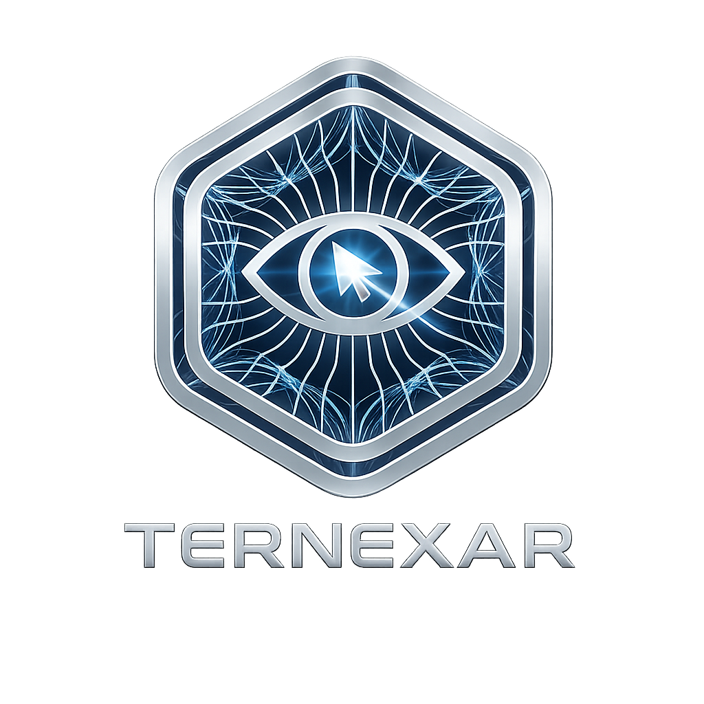

<p align="center">
  
</p>

<h1 align="center">TERNEXAR</h1>

<p align="center">
  Autonomous execution engine for terminal workflows, agentic tasks, and developer automation.
</p>

<p align="center">
  
  
  
  
</p>

---

## What is TERNEXAR?

**TERNEXAR** is an open-source autonomous execution engine designed to help developers plan, run, and manage terminal-based workflows through agent-style commands.

It is built for developers who want a faster way to automate repetitive tasks, coordinate command execution, improve local workflows, and experiment with agentic developer tooling.

---

## Why TERNEXAR?

Modern development involves many repeated terminal actions:

- running tests
- checking project health
- fixing small issues
- managing git workflows
- executing multi-step tasks
- preparing projects for release
- coordinating local automation

TERNEXAR aims to turn those workflows into a cleaner, smarter, and more extensible execution layer.

---

## Features

- Agent-style terminal workflow execution
- Task planning and command routing
- Developer automation foundation
- Git-friendly project workflow
- Python-first core
- Shell integration support
- Contributor-friendly open-source structure
- Designed for future AI agent integration

---

## Quick Start

```bash
tx
